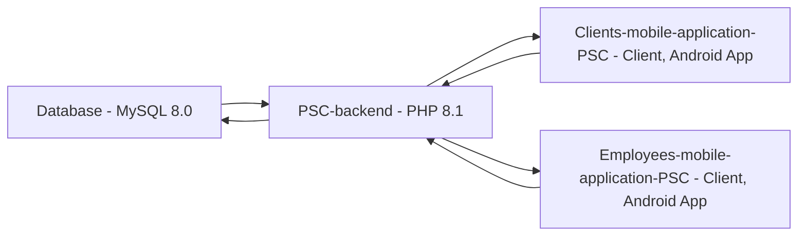

Check out [Clients-mobile-application-PSC](https://github.com/ReevesKKO/Clients-mobile-application-PSC) and [Employees-mobile-application-PSC](https://github.com/ReevesKKO/Employees-mobile-application-PSC).

## How it is supposed to work:

